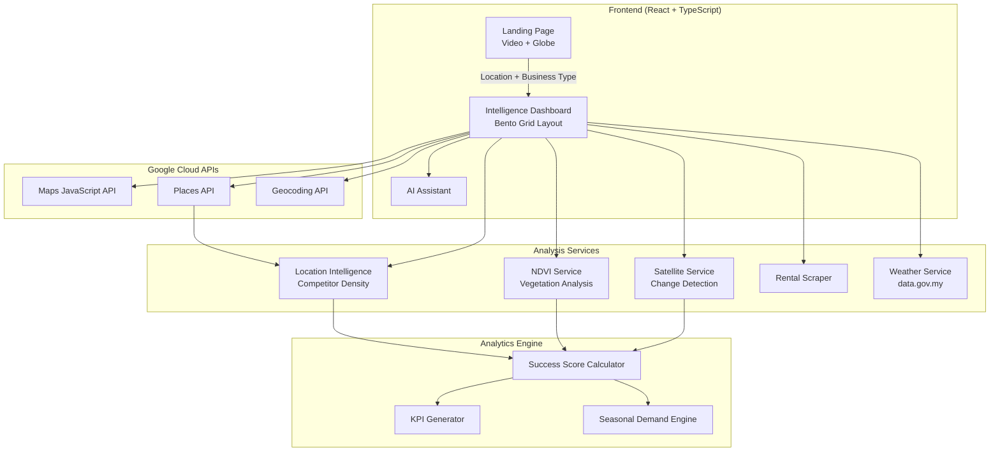

<p align="center">
  
</p>

<h1 align="center">🌍 Tapak — Location Intelligence Platform</h1>

<p align="center">
  <em>AI-powered location intelligence for smarter business decisions in Malaysia</em>
</p>

<p align="center">
  
  
  
  
  
</p>

---

## 📌 Repository Overview

**Tapak** (Malay for "footprint" / "site") is a web-based location intelligence platform built for the **Google Solution Challenge Hackathon**. It empowers aspiring entrepreneurs, SMEs, and franchise operators in Malaysia to make data-driven decisions about *where* to set up their business.

### 👥 Team Introduction

| Name | Role | GitHub |
|------|------|--------|
| **frenzy2004** | Lead Developer / Full-Stack | [@frenzy2004](https://github.com/frenzy2004) |
| **Lpx-0128** | Developer / Backend & APIs | [@Lpx-0128](https://github.com/Lpx-0128) |

---

## 🧭 Project Overview

### Problem Statement

In Malaysia, **over 50% of new SMEs fail within the first five years**, with poor location choice being a leading contributor. Entrepreneurs often rely on gut feeling, hearsay, or limited personal experience when choosing a business location. Access to comprehensive location data — competitor analysis, foot traffic estimates, urban development trends, rental pricing — is typically locked behind expensive enterprise tools that small business owners cannot afford.

### 🎯 SDG Alignment

| SDG | Alignment |
|-----|-----------|
| **SDG 8 — Decent Work & Economic Growth** | Tapak directly supports inclusive and sustainable economic growth by empowering entrepreneurs with data-driven insights to establish successful businesses, creating jobs and reducing SME failure rates. |
| **SDG 9 — Industry, Innovation & Infrastructure** | The platform leverages satellite imagery, AI analytics, and Google Maps infrastructure to democratize access to commercial intelligence tools previously available only to large corporations. |
| **SDG 11 — Sustainable Cities & Communities** | Through NDVI vegetation analysis and urban change detection, Tapak encourages entrepreneurs to consider environmental factors in their location decisions, promoting sustainable urban development. |

### Solution Description

Tapak is a **one-stop location intelligence dashboard** that aggregates multiple data sources — Google Maps, satellite imagery, weather data, rental market data, and AI-powered analytics — into an intuitive, visually stunning interface. Users simply enter a location and business type, and Tapak generates a comprehensive intelligence report including competitor mapping, success score predictions, seasonal demand forecasts, urban development analysis, and rental comparisons.

---

## ⭐ Key Features

| Feature | Description |
|---------|-------------|
| 🗺️ **Interactive Competitor Map** | Google Maps integration with real-time nearby business discovery, radius overlays, and clickable markers |
| 📊 **AI Success Score** | Predicted business success percentage calculated from satellite data, competition density, and urban metrics |
| 📈 **Market Analytics Suite** | Seasonal demand trends, demographic breakdowns, competitor scatter plots, and KPI dashboards |
| 🛰️ **Satellite Change Detection** | Before/after satellite imagery comparison to assess urban development and infrastructure changes |
| 🌿 **NDVI Vegetation Analysis** | Normalized Difference Vegetation Index analysis for environmental quality assessment |
| 🏘️ **Rental Analysis** | Location-based rental price scraping and comparison (RM per sq ft) |
| 🌤️ **Weather Integration** | Real-time weather data from Malaysia's data.gov.my API |
| 🤖 **AI Assistant** | Context-aware floating chatbot that can answer questions about the current analysis |
| 📄 **PDF Export** | Generate detailed downloadable reports with charts, maps, and insights |
| 🌐 **3D Globe Landing** | Cinematic video background with interactive WebGL globe (COBE) |
| 🔄 **Multi-Tab Comparison** | Open multiple location analyses side-by-side with cached data |

---

## 🛠️ Overview of Technologies Used

### Google Technologies

| Technology | Usage in Tapak |
|------------|----------------|
| **Google Maps JavaScript API** | Core interactive map rendering with custom overlays, radius circles, and styled map themes |
| **Google Places API** | Real-time autocomplete for location search, nearby business discovery with ratings/reviews/photos |
| **Google Geocoding API** | Converting user-entered addresses and place names into precise lat/lng coordinates for analysis |

### Supporting Tools & Libraries

| Category | Technologies |
|----------|-------------|
| **Frontend Framework** | React 18 with TypeScript |
| **Styling** | Tailwind CSS 3.4, custom Claymorphism design system |
| **3D & Animations** | COBE (WebGL globe), Three.js, Framer Motion, GSAP |
| **Data Visualization** | Chart.js + react-chartjs-2 (line, donut, scatter, bar, gauge charts) |
| **UI Components** | Radix UI primitives, shadcn/ui, Lucide Icons |
| **PDF Generation** | jsPDF + html2canvas |
| **Backend/Data** | Supabase, Express, data.gov.my weather API |
| **Satellite Analysis** | Custom unified API service (change detection + NDVI) |
| **Build Tool** | Vite 7 |

---

## 🏗️ Implementation Details & Innovation

### System Architecture



### Workflow

1. **User Input** — User enters a location (with Google Places autocomplete) and selects business type + scale
2. **Geocoding** — Location is geocoded via Google Geocoding API to obtain coordinates
3. **Parallel Data Fetching** — Multiple services run simultaneously:
   - Google Places API discovers nearby competitors
   - Satellite API performs change detection analysis
   - Weather service fetches local forecast
   - Rental data is scraped for the area
4. **Analytics Calculation** — The analytics engine processes all gathered data to compute:
   - Success score (weighted combination of competition, urban growth, vegetation, satellite data)
   - KPI metrics (foot traffic estimates, demand levels, competitor density)
   - Seasonal demand projections
5. **Dashboard Rendering** — Results are displayed in a bento grid dashboard with interactive preview cards
6. **Deep Dive** — Users can click any card to expand into full-screen detail views (map, analytics, urban analysis)

### Innovation Highlights

- **Multi-source data fusion**: Combines Google Maps business data with satellite imagery and environmental analysis for holistic location intelligence
- **Democratized corporate tools**: Enterprise-grade location analytics made accessible through a free, beautiful interface
- **Real-time Malaysian context**: Integrated with local APIs (data.gov.my weather, Malaysian business classifications)
- **Claymorphism UI**: Custom design system with soft shadows, rounded forms, and smooth micro-animations for a premium feel
- **Offline-resilient**: Graceful fallback to mock data when external APIs are unavailable

---

## 🚧 Challenges Faced

| Challenge | How We Solved It |
|-----------|-----------------|
| **Google Maps API rate limits** | Implemented caching per analysis tab — switching between tabs uses cached data instead of re-fetching |
| **Satellite imagery availability** | Built a unified API service with fallback mock data when the backend is unavailable |
| **NDVI data interpretation** | Created a custom vegetation change analysis engine that translates raw NDVI values into actionable business insights |
| **UI/UX consistency at scale** | Designed a comprehensive Claymorphism design system with reusable tokens, ensuring visual consistency across 20+ components |
| **Multiple branch coordination** | Maintained separate UI/UX and main branches, merging carefully to preserve design integrity while incorporating backend features |
| **Performance with heavy visuals** | Lazy-loaded chart components, optimized WebGL globe rendering, and used efficient state management to keep the app responsive |

---

## ⚙️ Installation & Setup

### Prerequisites

- **Node.js** v18 or higher
- **Google Maps API Key** with the following APIs enabled:
  - Maps JavaScript API
  - Places API
  - Geocoding API

### Quick Start

```bash
# 1. Clone the repository
git clone https://github.com/frenzy2004/Tapak-Kita-Hack.git
cd Tapak-Kita-Hack

# 2. Install dependencies
npm install

# 3. Configure environment variables
cp .env.example .env
```

Edit the `.env` file and add your API key:

```env
VITE_GOOGLE_MAPS_API_KEY=your_google_maps_api_key_here
```

```bash
# 4. Start the development server
npm run dev
```

The app will be available at `http://localhost:5173`

### Google Maps API Key Setup

1. Go to [Google Cloud Console](https://console.cloud.google.com/)
2. Create a new project or select an existing one
3. Navigate to **APIs & Services → Library**
4. Enable: **Maps JavaScript API**, **Places API**, **Geocoding API**
5. Go to **APIs & Services → Credentials**
6. Click **Create Credentials → API Key**
7. (Recommended) Restrict the key to your domain under **Application restrictions**
8. Copy the key into your `.env` file

### Available Scripts

| Command | Description |
|---------|-------------|
| `npm run dev` | Start development server |
| `npm run build` | Build for production |
| `npm run preview` | Preview production build |
| `npm run lint` | Run ESLint |

---

## 🔮 Future Roadmap

- [ ] **Foot Traffic Heatmaps** — Integrate real-time foot traffic data visualization using Google Maps heatmap layers
- [ ] **AI-Powered Recommendations** — Use Gemini API to generate natural language location recommendations based on analysis data
- [ ] **User Accounts & Saved Reports** — Supabase auth integration for saving and sharing analysis reports
- [ ] **Mobile PWA** — Progressive Web App support for on-the-go location scouting
- [ ] **Expanded Malaysian Data** — Integrate DOSM (Department of Statistics Malaysia) data for demographic and economic insights
- [ ] **Multi-language Support** — Bahasa Malaysia and Mandarin translations
- [ ] **Collaborative Analysis** — Real-time shared workspaces for business partners to review analyses together
- [ ] **Historical Trends** — Time-series analysis showing how location metrics change over months/years

---

## 📝 License

This project is licensed under the MIT License — see the [LICENSE](LICENSE) file for details.

---

<p align="center">
  Built with ❤️ for the Google Solution Challenge
</p>